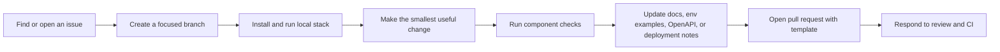

# Contributing To MicroAI Paygate

Thanks for helping improve MicroAI Paygate. This project is open to focused bug fixes, documentation improvements, tests, deployment/config cleanup, and carefully scoped features.

MicroAI Paygate is security-sensitive: it handles wallet signatures, payment contexts, replay protection, receipts, rate limits, and service-to-service calls. Small changes can cross service boundaries, so read this guide before opening a pull request.

## Contributor Workflow



## Repository Components

| Component | Path | Main responsibility |
| --- | --- | --- |
| Gateway | `gateway/` | Go/Gin HTTP gateway, x402 challenge creation, verifier orchestration, AI provider calls, CORS, gzip, rate limits, Redis cache, receipts, health/readiness. |
| Verifier | `verifier/` | Rust/Axum EIP-712 signature verification, expected chain enforcement, timestamp freshness, in-memory nonce replay protection. |
| Web | `web/` | Next.js frontend, wallet detection, Base Sepolia switching, EIP-712 signing, signed retry, result display. |
| E2E | `tests/`, `run_e2e.sh` | Bun tests for unsigned challenge, signed retry, upstream behavior, and replay rejection. |
| Benchmarks | `bench/` | Verifier-only benchmark harness and raw measured results. |
| Deployment | `deploy/`, `DEPLOY.md`, `.env.production.example`, `docker-compose.yml` | Fly/Vercel/Upstash prep, local Compose stack, ports, service names, health checks, and environment wiring. |

## First-Time Setup

Install:

- Bun `1.3.13+`
- Go `1.24.x`
- Rust stable
- Docker and Redis only when using Docker Compose or Redis-backed local receipts/cache

Then run:

```bash
git clone https://github.com/AnkanMisra/MicroAI-Paygate.git
cd MicroAI-Paygate

bun install
(cd web && bun install)
(cd gateway && go mod download)
(cd verifier && cargo build -q)
cp .env.example .env
```

Edit `.env` with development values. Use an unfunded local server wallet key. Never paste funded wallet keys, seed phrases, production Redis URLs, or real API keys into issues or pull requests.

Start the local stack:

```bash
bun run stack
```

This starts:

- Gateway: `http://localhost:3000`
- Web: `http://localhost:3001`
- Verifier: `http://localhost:3002`

The root stack command defaults to memory receipts and cache disabled unless those values are exported in your shell, so Redis is not required for the normal quick start.

## Docker Compose Setup

Use Docker Compose when you want Redis-backed receipts locally:

```bash
cp .env.example .env
docker-compose up --build
```

Inside Compose, use service names instead of localhost:

- Gateway to verifier: `http://verifier:3002`
- Gateway to Redis: `redis:6379`
- Browser to gateway: `http://localhost:3000`

## Branch And Pull Request Rules

- Work on a branch. Do not make unrelated changes on `main`.
- Keep pull requests small and reviewable.
- Link the issue when one exists.
- Use the PR template and list exact validation commands.
- Update docs/config with behavior changes.
- Do not force-push shared branches without coordination.
- Do not commit generated build output, `.env` files, secrets, private keys, or local IDE files.

Recommended branch names:

```bash
git checkout -b fix/gateway-timeout
git checkout -b docs/contributor-setup
git checkout -b feat/web-receipt-viewer
```

## Validation Matrix

Run the checks for the area you touched. When a change crosses services, run every affected service's checks.

| Changed area | Required local checks |
| --- | --- |
| `gateway/**` | `cd gateway && gofmt -w . && go test -v ./... && go vet ./...` |
| `verifier/**` | `cd verifier && cargo fmt -- --check && cargo clippy -- -D warnings && cargo test` |
| `web/**` | `cd web && bun run lint && bun run build && bun run test` |
| `tests/**` or x402 flow | `bun run test:e2e` when `OPENROUTER_API_KEY` is available |
| `gateway/openapi.yaml` | YAML parse plus compare against gateway routes |
| `.github/workflows/**` | YAML parse and explain which paths trigger checks |
| Docker/Compose/deploy docs | Validate YAML/TOML where practical and do not run real deploy commands unless maintainers explicitly approve |
| Documentation only | Run stale-text searches and any command examples you changed when practical |

Do not use plain `bun test` as a replacement for `bun run test:e2e`; plain `bun test` does not start gateway and verifier.

## Docs And Config Sync Requirements

Update all affected docs/config in the same pull request when you change:

- Environment variables.
- Ports or service names.
- HTTP routes, headers, status codes, or response bodies.
- x402 payment context fields.
- EIP-712 domain name/version/chain/verifying contract/types.
- Receipt shape, TTL, storage, or lookup behavior.
- CORS, trusted proxy, rate limit, timeout, Redis, cache, or provider defaults.
- Docker Compose, Fly, Vercel, Upstash, or CI behavior.

Common files to check:

- `README.md`
- `CONTRIBUTING.md`
- `gateway/README.md`
- `verifier/README.md`
- `web/README.md`
- `tests/README.md`
- `gateway/openapi.yaml`
- `.env.example`
- `.env.production.example`
- `docker-compose.yml`
- `DEPLOY.md`
- `.github/workflows/*`

## Security-Sensitive Review Areas

Treat these changes as security-sensitive even if they look small:

- `PaymentContext` fields in Go, Rust, TypeScript, tests, or docs.
- `X-402-Signature`, `X-402-Nonce`, or `X-402-Timestamp` handling.
- Signature expiry, client clock skew, chain ID, or recipient/token/amount validation.
- Verifier nonce replay protection.
- Receipt signing, receipt TTL, receipt lookup, and Redis persistence.
- Cache behavior. Cached responses must still require valid payment verification.
- Rate limit key selection and trusted proxy configuration.
- CORS allowed origins and exposed headers.
- Logging of request headers, verifier errors, private keys, API keys, Redis URLs, or wallet material.
- GitHub Actions permissions and workflows that can write to the repository.

## Public API And OpenAPI

The gateway's public contract is documented in `gateway/openapi.yaml` and served from:

- `GET /openapi.yaml`
- `GET /docs`

If you change a public gateway endpoint, update `gateway/openapi.yaml` in the same pull request. Internal verifier details belong in `verifier/README.md`.

## E2E Behavior

`bun run test:e2e` uses `run_e2e.sh` to build and start the verifier and gateway before running Bun tests. The helper defaults to:

- `RECEIPT_STORE=memory`
- `CACHE_ENABLED=false`

The default OpenRouter path still requires `OPENROUTER_API_KEY` for gateway startup. If a signed request returns `502 upstream_unavailable` or `504 upstream_timeout`, payment verification may have succeeded and only the upstream model call failed. Read the test output before assuming the x402 flow broke.

## Security Reports

Do not open public issues for vulnerabilities. Follow [SECURITY.md](SECURITY.md). Public issues and pull requests must not include exploit details, leaked secrets, private keys, seed phrases, or full `.env` files.

## Maintainer Review Expectations

Reviewers should check the whole affected flow, not only changed lines. Cross-service behavior often touches gateway structs, verifier structs, web typed data, E2E signing, OpenAPI, README diagrams, env examples, Docker, deployment docs, and CI path filters.

Pull requests are easiest to merge when they:

- Solve one clear problem.
- Include tests or a clear reason tests are not applicable.
- Keep docs/config synchronized.
- Preserve honest benchmark and production-readiness claims.
- Avoid unrelated dependency churn or formatting-only diffs.
