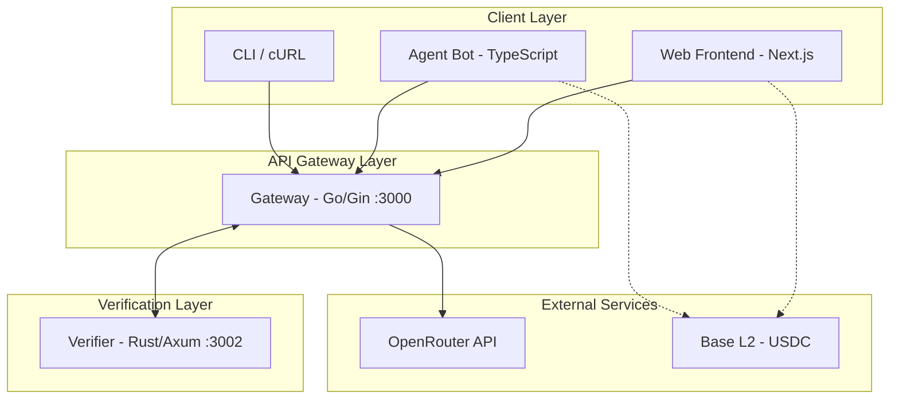
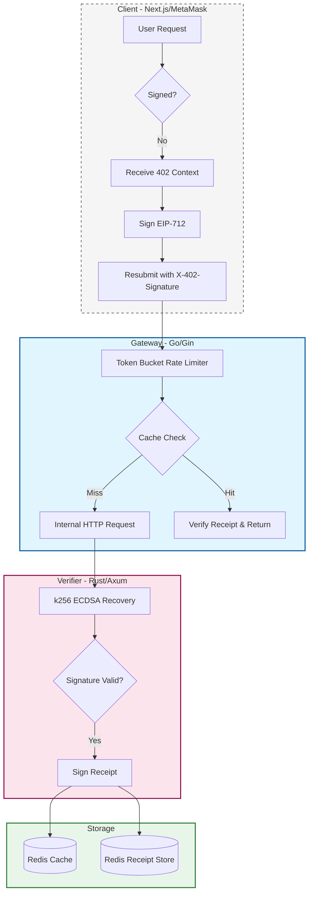
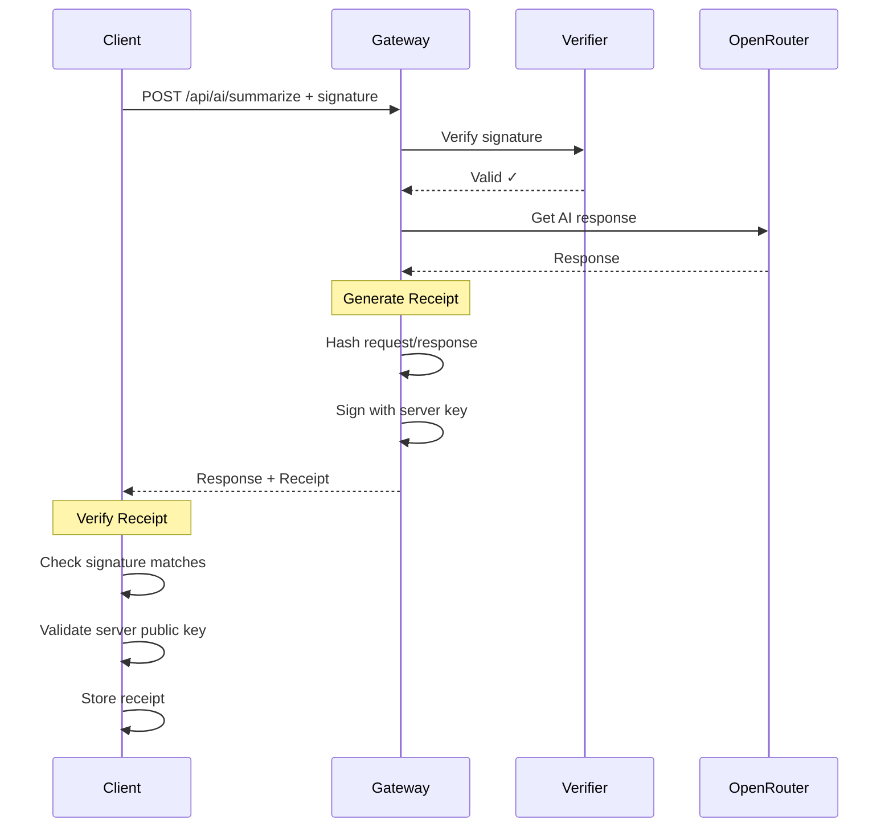

<div align="center">
    <h1>MicroAI Paygate</h1>
    
    <p>A high-performance, crypto-monetized AI microservice architecture implementing the x402 Protocol.</p>
</div>

<p align="center">
  <a href="https://github.com/AnkanMisra/MicroAI-Paygate/actions/workflows/go-tests.yml"></a>
  <a href="https://github.com/AnkanMisra/MicroAI-Paygate/actions/workflows/rust-tests.yml"></a>
  <a href="https://github.com/AnkanMisra/MicroAI-Paygate/actions/workflows/web-lint-build.yml"></a>
  <a href="https://github.com/AnkanMisra/MicroAI-Paygate/actions/workflows/e2e.yml"></a>
  <a href="LICENSE"></a>
</p>

> Open-sourced and maintained as a solo project — ~15 distinct external contributors merged via PR review across ~3 months, with the architecture, design, and merges owned by [@AnkanMisra](https://github.com/AnkanMisra). No formal program affiliation.

## Documentation

- [Getting Started](README.md#getting-started-local)
- [Testing](README.md#testing)
- [Contributing Guide](CONTRIBUTING.md)
- [Project Rules](RULES.md)
- [License](LICENSE)

## Overview

MicroAI Paygate demonstrates a decentralized payment layer for AI services. Instead of traditional subscriptions, it utilizes the HTTP 402 (Payment Required) status code to enforce per-request crypto micropayments. The system has been re-architected from a monolithic Node.js application into a distributed microservices stack to ensure maximum throughput, type safety, and cryptographic security.

## Features

- **x402 Protocol Implementation**: Native handling of the HTTP 402 status code to gate resources.
- **Distributed Architecture**: Decoupled services for routing (Go), verification (Rust), and presentation (Next.js).
- **EIP-712 Typed Signatures**: Industry-standard secure signing for payment authorization.
- **Micropayments**: Low-cost transactions (0.001 USDC) on the Base L2 network.
- **High Concurrency**: Go-based gateway for handling thousands of simultaneous connections.
- **Memory Safety**: Rust-based verification service for secure cryptographic operations.
- **Token Bucket Rate Limiting**: Configurable per-IP and per-wallet rate limits with tiered access control.


## How MicroAI Paygate is Different

Most AI monetization platforms rely on Web2 subscription models (Stripe, monthly fees) or centralized credit systems. These approaches introduce friction, require user registration, and create central points of failure.

MicroAI Paygate is designed to be frictionless and trustless:

1.  **No Registration**: Users connect a wallet and pay only for what they use.
2.  **Stateless Verification**: The verification logic is purely cryptographic and does not require database lookups for session management.
3.  **Polyglot Performance**: We use the right tool for the job—Go for I/O bound routing, Rust for CPU-bound cryptography, and TypeScript for UI.
4.  **Standard Compliance**: Fully compliant with EIP-712, ensuring users know exactly what they are signing.

## Measured Verifier Benchmark

The reproducible verifier micro-benchmark lives in [`bench/`](bench/README.md) and measures only the Rust `/verify` endpoint. It does not measure gateway, wallet UI, Redis, OpenRouter, or end-to-end x402 latency.

Latest local run: `bench/RESULTS-2026-05-13.txt` on Apple M2, 8 cores, 8GB RAM with `wrk 4.2.0`, 2 threads, 32 connections, 30 seconds, and 1000 rotated signed payloads.

| Metric | Result |
| :--- | :--- |
| Requests/sec | 1526.94 |
| p99 latency | 85.45ms |

## Architecture & Backend Internals

### System Architecture



### x402 Protocol Flow

The x402 protocol enables trustless, per-request payments using cryptographic signatures:



## 🛡️ Security & Cryptographic Integrity

MicroAI Paygate implements the **x402 Protocol** using a zero-trust verification model. We utilize **EIP-712** typed signatures to prevent phishing and "blind signing" attacks common with raw hex strings.

### 1. Cryptographic Verification Logic
The Rust Verifier performs Elliptic Curve Digital Signature Algorithm (ECDSA) recovery to ensure the signer address $\sigma_{addr}$ matches the expected payer. The verification follows the logic:

$$V(m, \sigma) \rightarrow \text{Address}$$

Where:
- $m$: The EIP-712 structured hash of the `PaymentContext`.
- $\sigma$: The $65$-byte signature provided in the `X-402-Signature` header.
- The request is only granted if $\sigma_{addr} \in \text{Authorized Payers}$.

### 2. Memory Safety & Concurrency
By utilizing **Rust (k256)** for the verification layer, the system remains immune to:
- **Buffer Overflows:** Prevents malicious signatures from corrupting memory.
- **Race Conditions:** Rust's strict ownership model ensures thread-safe signature recovery during high-concurrency peaks.

### Payment Context Structure

When a `402 Payment Required` response is returned, it includes the payment context:

```json
{
  "error": "Payment Required",
  "message": "Please sign the payment context",
  "paymentContext": {
    "recipient": "0x2cAF48b4BA1C58721a85dFADa5aC01C2DFa62219",
    "token": "USDC",
    "amount": "0.001",
    "nonce": "9c311e31-eb30-420a-bced-c0d68bc89cea",
    "chainId": 8453
  }
}
```

The client signs this data using EIP-712 and resends with headers:
- `X-402-Signature`: The cryptographic signature
- `X-402-Nonce`: The nonce from the payment context

---

### The Gateway (Go)
The Gateway service utilizes Go's lightweight goroutines to handle high-throughput HTTP traffic. Unlike the Node.js event loop which can be blocked by CPU-intensive tasks, the Go scheduler efficiently distributes requests across available CPU cores.
- **Framework**: Gin (High-performance HTTP web framework)
- **Concurrency Model**: CSP (Communicating Sequential Processes)
- **Upstream Calls**: Plain `net/http` clients with per-call `context.Context` deadlines. The gateway is not a transparent reverse proxy — it owns the verify → AI → receipt-sign flow and shapes the response (including the `X-402-Receipt` header) before returning to the client.

### The Verifier (Rust)
The Verifier is a specialized computation unit designed for one task: Elliptic Curve Digital Signature Algorithm (ECDSA) recovery.
- **Safety**: Rust's ownership model guarantees memory safety without a garbage collector.
- **Cryptography**: Uses `ethers-rs` bindings to `k256` for hardware-accelerated math.
- **Isolation**: Running as a separate binary ensures that cryptographic load never impacts the API gateway's latency.

## Limitations & What's Next

This section exists because every honest project has rough edges, and pretending otherwise is the fastest way to lose credibility in a code review. These are the things I know are imperfect today:

- **Receipts now default to Redis-backed storage** (`RECEIPT_STORE=redis`) with the same TTL used by the receipt lookup API. `RECEIPT_STORE=memory` is still available for tests and local experiments, but memory mode loses receipts on restart and should not be used for multi-replica deployments.
- **A valid signature is not a settled payment.** The verifier proves the signer authorized the payment context; it does not check that USDC actually moved on Base. A production deployment would either (a) require pre-paid balances tracked off-chain, (b) poll an indexer for on-chain settlement before fulfilling, or (c) accept the float risk for tiny micropayments. This system does (c) implicitly, which is acceptable for a demo but not for real money at scale.
- **Single-chain hardcoded to Base / Base Sepolia.** Multi-chain support would require dynamic EIP-712 domains and per-chain recipient/token configs. Not difficult, just not done.
- **Replay protection relies on a 5-minute timestamp window**, not a persistent nonce store. Inside the window, the same `(signature, nonce, timestamp)` triple is technically reusable. A nonce-set in Redis would close this gap; the timestamp window is a deliberate "good enough for low-value demo traffic" choice.
- **Rate limiter is per-process and in-memory.** Horizontal scaling of the gateway would silently weaken the limits, since each replica has its own token buckets. Distributed rate limiting (e.g., Redis-backed sliding window) is a known follow-up.
- **Demo runs against free OpenRouter models** (`z-ai/glm-4.5-air:free`). Summaries are mediocre by design — this is a deliberate cost tradeoff to keep the public demo at zero recurring spend.

If you find more, open an issue — but note that PR reviews are paused for the current placement season and will resume after.

## Installation & Deployment

### Getting Started (Local)

### 📋 Environment Matrix
Before setting up the local environment, ensure your system meets the following polyglot requirements:

| Dependency | Version | Role |
| :--- | :--- | :--- |
| **Go** | `1.24.4+` | Edge Gateway & Token Bucket Rate Limiting |
| **Rust** | `Stable` | Cryptographic Verifier (ethers-rs / EIP-712 Recovery) |
| **Node.js** | `20+` | Next.js 16.1.1 Frontend & UI Tooling |
| **Bun** | `Latest` | Unified Task Runner & High-Speed E2E Testing |
| **Redis** | `7.0+` | Receipt Caching, TTL Management, & Persistence |

**Clone & Install**
```bash
git clone https://github.com/AnkanMisra/MicroAI-Paygate.git
cd MicroAI-Paygate
bun install
go mod tidy -C gateway
cargo build -q -C verifier
```

**Configure Environment**
Copy `.env.example` to `.env` and fill values (see next section).

**Run the Stack**
```bash
bun run stack
```
This local command runs the gateway with `RECEIPT_STORE=memory` and `CACHE_ENABLED=false` unless you override those variables, so the documented quick-start path does not require Redis. Use Docker Compose or set `RECEIPT_STORE=redis REDIS_URL=localhost:6379` when you want to exercise Redis-backed receipts locally.

**Run Tests**
```bash
bun run test:unit   # Go + Rust unit tests
bun run test:go     # Gateway tests only
bun run test:rust   # Verifier tests only
bun run test:e2e    # E2E (starts services automatically)
bun run test:all    # Full test suite with E2E
```

### Makefile Shortcuts

Use the Makefile to orchestrate builds, tests, and linting across all services:

```bash
make help    # Show all available Makefile targets
make all     # Default target (alias for build)
make build   # Build Gateway, Verifier, Web
make test    # Run Go, Rust, and Web tests
make lint    # Run Go vet, Rust clippy, Web lint
make dev     # Start full stack (via bun run stack)
make clean   # Clean build artifacts
```

> **Note:** Do NOT use `bun test` directly - it triggers bun's native test runner without starting services.

### Environment

Create a `.env` (or use `.env.example`) with at least:

- `OPENROUTER_API_KEY` — API key for OpenRouter **(required - validated at startup)**
- `OPENROUTER_MODEL` — model name (default: `z-ai/glm-4.5-air:free`)
- `SERVER_WALLET_PRIVATE_KEY` — private key for the server wallet (recipient of payments)
- `RECIPIENT_ADDRESS` — wallet address for receiving payments
- `CHAIN_ID` — chain used in signatures (default: `8453` for Base)

> **Note:** The gateway validates required environment variables at startup. If `OPENROUTER_API_KEY` is missing, the server will exit with a helpful error message.

**Optional Configuration:**
- `USDC_TOKEN_ADDRESS` — USDC contract address (default: Base USDC)
- `PAYMENT_AMOUNT` — cost per request in USDC (default: `0.001`)
- `VERIFIER_URL` — URL of verifier service (default: `http://127.0.0.1:3002`)

Ensure ports `3000` (gateway), `3001` (web), and `3002` (verifier) are free.

### Rate Limiting Configuration

MicroAI Paygate implements token bucket rate limiting to prevent abuse and protect API quotas.

**Features:**
- Token bucket algorithm with burst support
- Tiered limits (anonymous, authenticated, verified)
- Per-IP and per-wallet tracking
- Standard `X-RateLimit-*` headers

**Default Limits:**

| Tier | Requests/Minute | Burst | Identification |
|------|----------------|-------|----------------|
| Anonymous | 10 | 5 | IP address |
| Standard | 60 | 20 | Signed requests (wallet nonce) |
| Verified | 120 | 50 | Premium users (future) |

**Configuration:**
Add to your `.env` file:
```bash
# Rate Limiting
RATE_LIMIT_ENABLED=true

# Anonymous users (IP-based, no signature)
RATE_LIMIT_ANONYMOUS_RPM=10
RATE_LIMIT_ANONYMOUS_BURST=5

# Standard users (signed requests)
RATE_LIMIT_STANDARD_RPM=60
RATE_LIMIT_STANDARD_BURST=20

# Verified users (future: premium tier)
RATE_LIMIT_VERIFIED_RPM=120
RATE_LIMIT_VERIFIED_BURST=50

# Cleanup interval for stale buckets (seconds)
RATE_LIMIT_CLEANUP_INTERVAL=300
```

**Response Headers:**
- `X-RateLimit-Limit`: Max requests per minute for your tier
- `X-RateLimit-Remaining`: Requests remaining
- `X-RateLimit-Reset`: Unix timestamp when limit resets
- `Retry-After`: Seconds until reset (on 429 response)

### Request Timeouts

The gateway implements context-based request timeouts to prevent slow/hanging requests from consuming resources.

**Features:**
- Global request timeout (default: 60s)
- Per-endpoint configurable timeouts
- Context cancellation for downstream calls
- Buffered response to prevent race conditions
- Returns `504 Gateway Timeout` when exceeded

**Default Timeouts:**

| Endpoint | Timeout | Purpose |
|----------|---------|---------|
| Global | 60s | Maximum request duration |
| AI endpoints | 30s | OpenRouter calls |
| Verifier | 2s | Signature verification |
| Health check | 2s | `/healthz` endpoint |

**Configuration:**
```bash
# Request Timeouts
REQUEST_TIMEOUT_SECONDS=60
AI_REQUEST_TIMEOUT_SECONDS=30
VERIFIER_TIMEOUT_SECONDS=2
HEALTH_CHECK_TIMEOUT_SECONDS=2
```

### Caching Configuration

MicroAI Paygate includes an intelligent Redis-backed caching layer to reduce OpenRouter API costs and improve response times for frequently requested content.

**Features:**
- **Cache-Aside Pattern**: Checks Redis before calling AI provider. If found, data is returned instantly, but **payment verification is still enforced**.
- **Content-Addressable**: Uses SHA256 of request text as the cache key.
- **Secure by Design**: Cached responses are ONLY served to requests with valid payment signatures. The latency savings come from avoiding the AI provider call, not from skipping verification.
- **TTL-Based**: Configurable expiration to ensure content freshness.

**Configuration:**
Add to `.env`:
```bash
# Redis Configuration
# Use 'redis:6379' for docker-compose, 'localhost:6379' for local run
REDIS_URL=redis:6379
REDIS_PASSWORD=
REDIS_DB=0

# Receipt storage uses Redis by default so receipts survive gateway restarts.
RECEIPT_STORE=redis

# Optional cache settings. Disabled by default so cache writes cannot exhaust
# the Redis instance used for receipts.
CACHE_ENABLED=false
# Time-to-live for cached items in seconds (default: 3600 = 1 hour)
CACHE_TTL_SECONDS=3600
```

The Compose Redis service uses `--maxmemory-policy noeviction` so Redis will not evict `receipt:{id}` keys before `RECEIPT_TTL`. Response caching is off by default in Compose because cache and receipts share that Redis instance; enable `CACHE_ENABLED=true` only when you have dedicated cache capacity or accept that cache pressure can block new receipt writes.

### Docker Deployment (Production)

For production environments, we provide a containerized setup using Docker Compose. This orchestrates all three services in an isolated network.

1.  **Configure Environment**
    ```bash
    cp .env.example .env
    # Edit .env with your API keys and wallet configuration
    ```

2.  **Build and Run**
    ```bash
    docker-compose up --build -d
    ```

3.  **Verify Status**
    ```bash
    docker-compose ps
    ```

4.  **Logs**
    ```bash
    docker-compose logs -f
    ```

### Local Development

For rapid development, use the unified stack command which runs services on the host machine.

1.  **Install Prerequisites**
    - Bun, Go 1.24+, Rust/Cargo

2.  **Run Stack**
    ```bash
    bun run stack
    ```

## Testing
We maintain a comprehensive test suite covering all layers of the stack, from unit tests for individual microservices to full end-to-end (E2E) integration tests.

### End-to-End (E2E) Tests

The E2E tests simulate a real client interaction:
1.  Sending a request to the Gateway.
2.  Receiving a `402 Payment Required` challenge.
3.  Signing the challenge with an Ethereum wallet.
4.  Resubmitting the request with the signature.
5.  Verifying the successful AI response.

**Run E2E Tests:**
```bash
bun run test:e2e
```
Prerequisites: Bun, Go, and Rust toolchains installed. This command uses `run_e2e.sh` to build and start the Go Gateway and Rust Verifier before executing tests. The helper sets `RECEIPT_STORE=memory` and `CACHE_ENABLED=false` by default, so E2E does not require Redis unless you override those environment variables.
The default OpenRouter path still needs `OPENROUTER_API_KEY` for gateway startup; CI skips E2E when the secret is absent. With an invalid key, the signed path may return 500 after verification.

### Unit Tests

**Gateway (Go):**
Tests the HTTP handlers and routing logic.
```bash
cd gateway
go test -v
```

**Verifier (Rust):**
Tests the cryptographic verification logic and EIP-712 implementation.
```bash
cd verifier
cargo test
```

## Troubleshooting

- Port already in use: ensure 3000/3001/3002 are free or export alternative ports in env and update client config.
- Missing OpenRouter key: E2E tests may pass signature validation but fail on AI response with 500.
- Network errors inside Docker: use service names (`gateway:3000`, `verifier:3002`) instead of localhost.

## References

- HTTP 402 Payment Required (MDN): https://developer.mozilla.org/en-US/docs/Web/HTTP/Status/402
- RFC 7231 Section 6.5.2 (Payment Required): https://www.rfc-editor.org/rfc/rfc7231#section-6.5.2
- EIP-712 Typed Structured Data: https://eips.ethereum.org/EIPS/eip-712

## Receipt Verification

MicroAI Paygate issues cryptographic receipts for every successful API request. These receipts are tamper-proof, independently verifiable, and stored in Redis for 24 hours by default.

### Receipt Structure

Every successful request returns the AI result in the JSON body and a base64-encoded signed receipt in the `X-402-Receipt` header:

```json
{
  "result": "AI summary..."
}
```

### Client-Side Verification (TypeScript)

Use the provided verification library to verify receipts client-side:

```typescript
import { verifyReceipt, fetchReceipt } from './web/src/lib/verify-receipt';

// After receiving a response
const response = await fetch('/api/ai/summarize', {
  method: 'POST',
  headers: {
    'Content-Type': 'application/json',
    'X-402-Signature': signature,
    'X-402-Nonce': nonce,
  },
  body: JSON.stringify({ text: 'Your text here' }),
});

const receiptHeader = response.headers.get('X-402-Receipt');
const signedReceipt = receiptHeader
  ? JSON.parse(atob(receiptHeader))
  : null;

// Verify the receipt signature
const isValid = signedReceipt ? await verifyReceipt(signedReceipt) : false;
console.log(`Receipt valid: ${isValid}`); // true

// Store receipt for future reference
if (signedReceipt) {
  localStorage.setItem(
    `receipt_${signedReceipt.receipt.id}`,
    JSON.stringify(signedReceipt)
  );
}
```

### Receipt Lookup API

Retrieve stored receipts by ID:

```bash
# Fetch receipt
curl http://localhost:3000/api/receipts/rcpt_a1b2c3d4e5f6

# Response (200 OK)
{
  "receipt": { ... },
  "signature": "0x...",
  "server_public_key": "0x...",
  "status": "valid"
}

# Not found (404)
{
  "error": "Receipt not found",
  "message": "Receipt may have expired or never existed"
}
```

### Verification Flow



### Security Features

- **ECDSA Signatures**: Receipts signed using Keccak256 + secp256k1 (Ethereum-compatible)
- **Tamper-Proof**: Any modification invalidates the signature
- **Content Hashes**: Only SHA-256 hashes stored, not full request/response
- **Rate Limited**: Receipt lookup limited to 10 requests/minute (anonymous tier)
- **Auto-Expiry**: Receipts expire after 24 hours (configurable via `RECEIPT_TTL`)

### Configuration

Add to `.env`:

```bash
# Required: Server's private key for signing receipts
SERVER_WALLET_PRIVATE_KEY=your_private_key_hex

# Optional: Receipt TTL in seconds (default: 86400 = 24 hours)
RECEIPT_TTL=86400

# Optional: "redis" survives restarts; "memory" is for tests/local experiments
RECEIPT_STORE=redis
```

## API Reference

### Endpoints

#### `POST /api/ai/summarize`

**Description**
Proxies a text summarization request to the AI provider, enforcing payment via the x402 protocol.

**Request Headers**
| Header | Type | Required | Description |
| :--- | :--- | :--- | :--- |
| `Content-Type` | string | Yes | Must be `application/json` |
| `X-402-Signature` | hex string | Yes | The EIP-712 signature signed by the user's wallet. |
| `X-402-Nonce` | uuid | Yes | The nonce received from the initial 402 response. |

**Request Body**
```json
{
  "text": "The content to be summarized..."
}
```

**Response Codes**

| Status Code | Meaning | Payload Structure |
| :--- | :--- | :--- |
| `200 OK` | Success | `{ "result": "Summary text..." }` |
| `402 Payment Required` | Payment Needed | `{ "paymentContext": { "nonce": "...", "amount": "0.001", ... } }` |
| `403 Forbidden` | Invalid Signature | `{ "error": "Invalid Signature", "details": "..." }` |
| `500 Internal Error` | Server Failure | `{ "error": "Service unavailable" }` |

#### `POST /verify` (Internal)

**Description**
Internal endpoint used by the Gateway to verify signatures with the Rust service. Not exposed publicly.

**Body**
```json
{
  "context": { ... },
  "signature": "0x..."
}
```

## Contributing

We welcome contributions! Please read [CONTRIBUTING.md](CONTRIBUTING.md) for guidelines and check the [GitHub Issues](https://github.com/AnkanMisra/MicroAI-Paygate/issues) for open tasks.

## License

This project is licensed under the [MIT License](LICENSE).
