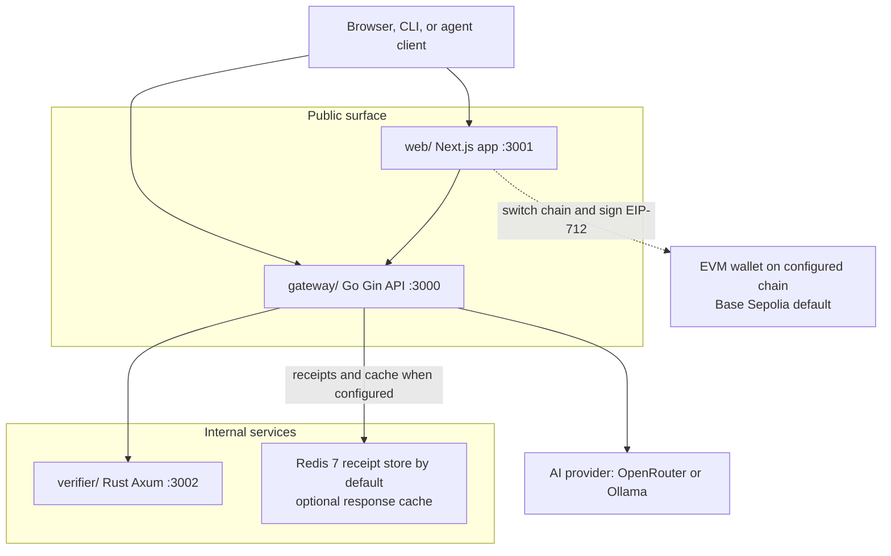
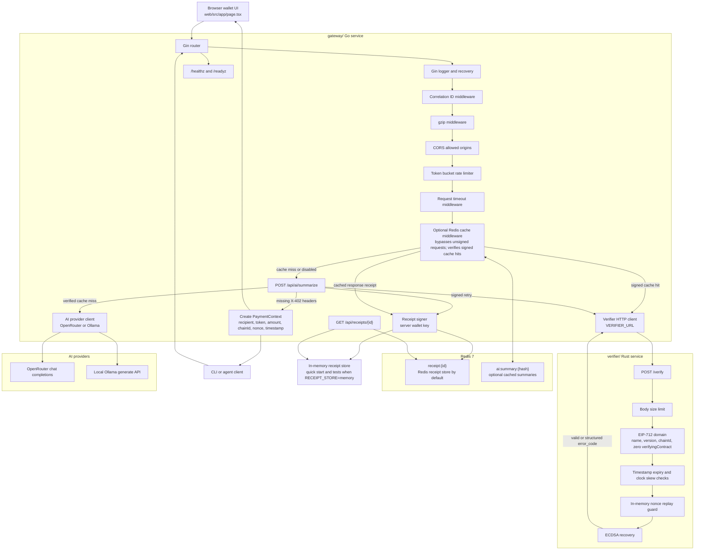
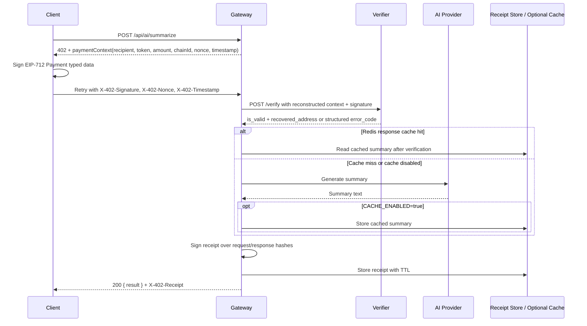
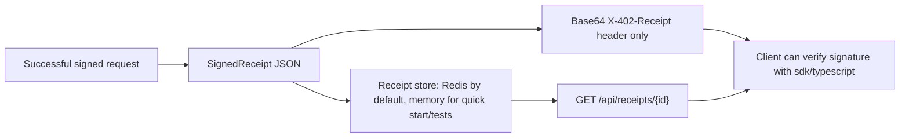

<div align="center">
  <h1>MicroAI Paygate</h1>
  
  <p>Open source x402-style payment gateway for AI API requests.</p>
</div>

<p align="center">
  <a href="https://github.com/AnkanMisra/MicroAI-Paygate/actions/workflows/go-tests.yml"></a>
  <a href="https://github.com/AnkanMisra/MicroAI-Paygate/actions/workflows/rust-tests.yml"></a>
  <a href="https://github.com/AnkanMisra/MicroAI-Paygate/actions/workflows/web-lint-build.yml"></a>
  <a href="https://github.com/AnkanMisra/MicroAI-Paygate/actions/workflows/sdk-tests.yml"></a>
  <a href="https://github.com/AnkanMisra/MicroAI-Paygate/actions/workflows/e2e.yml"></a>
  <a href="LICENSE"></a>
</p>

## Live Demo

**https://microai-paygate.vercel.app**

The backend services (gateway + verifier) are hosted on Render's free tier and **sleep after 15 minutes of inactivity**. The first request after a quiet period takes 30–50 seconds while both services wake. The web UI shows a brief warm-up banner during this window. Subsequent requests are normal speed.

The deployed stack is **Render** (Rust verifier + Go gateway) + **Vercel** (Next.js web) + **Upstash** (Redis for nonces and signed receipts). All on free tiers — total recurring cost is $0. See [DEPLOY.md](DEPLOY.md) for the step-by-step deployment guide.

The demo runs on **Base Sepolia testnet**. A valid EIP-712 signature proves wallet authorization for the payment context; it does not move USDC on-chain. Bring a wallet on Base Sepolia to try the full sign-and-summarize flow.

## What This Project Does

MicroAI Paygate demonstrates a payment-gated AI microservice stack. A client asks the gateway for an AI summary. If the request is unsigned, the gateway returns HTTP `402 Payment Required` with a payment context. The client signs that context with an EVM wallet using EIP-712 typed data and retries the request with `X-402-*` headers. The gateway verifies the signature through a Rust verifier service, calls the configured AI provider, signs a receipt, stores it, and returns the AI result.

This is a demo and contributor-friendly reference implementation. A valid signature proves wallet authorization for the payment context; it does not prove that USDC moved on-chain.

## Start Here

| Goal | Read |
| --- | --- |
| Run locally | [Getting Started](#getting-started-local) |
| Build an API client | [Use The SDK](#use-the-sdk) |
| Read website docs | Run `cd web && bun run dev`, then open `/docs` |
| Understand the architecture | [Architecture](#architecture) |
| Contribute code or docs | [CONTRIBUTING.md](CONTRIBUTING.md) |
| Review project rules | [RULES.md](RULES.md) |
| Report vulnerabilities | [SECURITY.md](SECURITY.md) |
| Get support | [SUPPORT.md](SUPPORT.md) |
| Deploy manually | [DEPLOY.md](DEPLOY.md) |
| Gateway API contract | [gateway/openapi.yaml](gateway/openapi.yaml) or `GET /docs` from the gateway |

## Repository Map

| Path | Purpose |
| --- | --- |
| `gateway/` | Go/Gin API gateway on port `3000`. Owns CORS, gzip, rate limits, timeouts, Redis cache, receipt storage, AI provider calls, x402 challenge creation, verifier calls, and receipt signing. |
| `verifier/` | Rust/Axum service on port `3002`. Verifies EIP-712 payment signatures, chain ID, timestamp freshness, and nonce replay for a single verifier instance. |
| `web/` | Next.js/Bun frontend on port `3001`. Requests summaries, handles `402` payment contexts, switches wallet chain, signs typed data, and retries with `X-402-*` headers. |
| `sdk/typescript/` | Private/local TypeScript SDK package for AI API builders. Handles `402` challenges, EIP-712 signing, signed retries, receipt decoding, and trusted-key receipt verification. |
| `tests/` and `run_e2e.sh` | Bun E2E flow covering unsigned challenge, signed retry, verifier acceptance, and replay rejection. |
| `bench/` | Reproducible verifier-only micro-benchmark. It does not measure end-to-end latency. |
| `deploy/`, `DEPLOY.md`, `.env.production.example` | Deployment prep for Render gateway/verifier, Vercel web, and Upstash Redis. Real deploy commands are manual. |
| `.github/workflows/` | CI for Go, Rust, web, SDK, E2E, branch freshness, and Claude review integration. |

## Architecture



### Deep System Design



### x402-Style Payment Flow



### Receipt Lifecycle



## Getting Started Local

### Prerequisites

| Tool | Version | Used by |
| --- | --- | --- |
| Bun | `1.3.13+` recommended | Root scripts, web install/build, E2E tests |
| Go | `1.24.x` | Gateway |
| Rust | Stable | Verifier |
| Docker | Optional | Compose stack and Redis |
| Redis | Optional for quick start | Required for Docker/production-style Redis receipts |

### Install

```bash
git clone https://github.com/AnkanMisra/MicroAI-Paygate.git
cd MicroAI-Paygate

bun install
(cd web && bun install)
(cd gateway && go mod download)
(cd verifier && cargo build -q)
```

### Configure

```bash
cp .env.example .env
```

Edit `.env` before starting the gateway. At minimum:

- `OPENROUTER_API_KEY`: required when `AI_PROVIDER=openrouter`.
- `SERVER_WALLET_PRIVATE_KEY`: required for signing receipts. Use an unfunded development key locally.
- `RECIPIENT_ADDRESS`: recipient address embedded in payment contexts.
- `CHAIN_ID` and `EXPECTED_CHAIN_ID`: must match. The default is `84532` for Base Sepolia.

The root `bun run stack` command starts the gateway with `RECEIPT_STORE=memory` and `CACHE_ENABLED=false` unless you exported different values in the shell. That means the normal quick start does not require Redis even though production-style receipt storage defaults to Redis.

### Run The Stack

```bash
bun run stack
```

Services:

- Gateway: `http://localhost:3000`
- Gateway Swagger UI: `http://localhost:3000/docs`
- Web: `http://localhost:3001`
- Verifier: `http://localhost:3002/health`

### Use The SDK

The local TypeScript SDK lives in [sdk/typescript/](sdk/typescript). It mirrors the current custom x402-style gateway protocol and is private for now; it is not published to npm.

```bash
cd sdk/typescript
bun install
bun run test
```

Install it into a local app from this repo path before importing the package name:

```bash
bun add /path/to/MicroAI-Paygate/sdk/typescript
```

Example app usage:

```ts
import { ethers } from "ethers";
import { PaygateClient } from "@microai/paygate-sdk";

const client = new PaygateClient({
  gatewayUrl: "http://localhost:3000",
  signer: new ethers.Wallet(process.env.EVM_PRIVATE_KEY!),
  trustedServerPublicKey: process.env.PAYGATE_SERVER_PUBLIC_KEY,
});

const response = await client.summarize("Text to summarize");
console.log(response.data.result);
console.log(response.receiptVerified);
```

For the runnable example, set:

```text
PAYGATE_GATEWAY_URL=http://localhost:3000
EVM_PRIVATE_KEY=0x...
PAYGATE_SERVER_PUBLIC_KEY=0x...
```

Use only unfunded local or test wallets. The SDK signs the same EIP-712 payment context as the web app and E2E tests, retries with the gateway's `X-402-*` headers, decodes `X-402-Receipt`, and verifies the receipt signature locally against the configured gateway receipt signing public key. If no trusted server public key is configured, receipt payload hashes are still checked but `receiptVerified` is `false`. It does not perform official x402 facilitator settlement.

### Docker Compose

Docker Compose starts gateway, verifier, web, and Redis. It uses service names inside the Docker network, so the gateway reaches the verifier at `http://verifier:3002` and Redis at `redis:6379`.

```bash
cp .env.example .env
docker-compose up --build
```

## Configuration

Core local variables live in [.env.example](.env.example). Production placeholders live in [.env.production.example](.env.production.example).

| Variable | Service | Notes |
| --- | --- | --- |
| `AI_PROVIDER` | Gateway | `openrouter` by default, `ollama` for local Ollama experiments. |
| `OPENROUTER_API_KEY` | Gateway | Required when using OpenRouter. Never commit a real key. |
| `OPENROUTER_MODEL` | Gateway | OpenRouter model name. Demo docs use `z-ai/glm-4.5-air:free` unless overridden. |
| `OLLAMA_URL`, `OLLAMA_MODEL` | Gateway | Used only when `AI_PROVIDER=ollama`. |
| `SERVER_WALLET_PRIVATE_KEY` | Gateway | Signs receipts. Use only unfunded local keys in development. |
| `RECIPIENT_ADDRESS` | Gateway/Web flow | Embedded in payment contexts returned by the gateway. |
| `CHAIN_ID` | Gateway/Web flow | EIP-712 chain ID in payment contexts. |
| `EXPECTED_CHAIN_ID` | Verifier | Verifier enforcement chain. Falls back to `CHAIN_ID` if unset. |
| `SIGNATURE_EXPIRY_SECONDS` | Verifier | Signature freshness and nonce retention window. Default `300`. |
| `SIGNATURE_CLOCK_SKEW_SECONDS` | Verifier | Future timestamp grace. Default `60`. |
| `RECEIPT_STORE` | Gateway | `redis` by default, `memory` for tests/local experiments. |
| `REDIS_URL` | Gateway | Required when `RECEIPT_STORE=redis` or `CACHE_ENABLED=true`. |
| `VERIFIER_URL` | Gateway | **Required.** Where the gateway calls `/verify` (e.g. `http://127.0.0.1:3002` for `bun run stack`, `https://<app>.onrender.com` for Render). The gateway refuses to start if unset — no silent loopback fallback. |
| `CACHE_ENABLED` | Gateway | Optional response cache. Payment verification still runs on cache hits. |
| `ALLOWED_ORIGINS` | Gateway | Comma-separated CORS origins, no paths or query strings. |
| `TRUSTED_PROXIES` | Gateway | Comma-separated trusted proxy CIDRs for production IP handling. |
| `NEXT_PUBLIC_GATEWAY_URL` | Web | Gateway base URL. Browser fetches `/api/ai/summarize` and `/api/receipts/:id` here. |
| `NEXT_PUBLIC_EXPECTED_CHAIN_ID` | Web | Chain ID the wallet widget targets. Must match the gateway's `CHAIN_ID`. Default `84532`. |
| `NEXT_PUBLIC_EXPECTED_CHAIN_NAME` | Web | Display name paired with the chain ID — used by the wallet widget's "Switch to <name>" button, hero headline, stat bar, and page title. Must be set when `CHAIN_ID` is overridden (e.g. `Base` for `8453`). |
| `NEXT_PUBLIC_PAYMENT_AMOUNT` | Web | Pre-challenge fee label shown in the summarize form + stat bar. Display only — the gateway's payment context controls the actual signed amount. Default `0.001`. |
| `NEXT_PUBLIC_PAYMENT_TOKEN` | Web | Token symbol paired with the amount. Default `USDC`. |

## Testing

| Area | Command | Notes |
| --- | --- | --- |
| Gateway tests | `cd gateway && go test -v ./...` | Uses miniredis for Redis behavior where needed. |
| Gateway vet | `cd gateway && go vet ./...` | Run for Go changes. |
| Verifier tests | `cd verifier && cargo test` | Covers EIP-712, chain ID, timestamp, and nonce behavior. |
| Verifier lint | `cd verifier && cargo fmt -- --check && cargo clippy -- -D warnings` | Run for Rust changes. |
| Web lint/build/typecheck | `cd web && bun run lint && bun run build && bun run test` | `bun run test` is `tsc --noEmit`. |
| SDK typecheck/tests | `cd sdk/typescript && bun run typecheck && bun run test` | Covers signing parity, signed retry headers, receipt decoding, trusted-key receipt verification, and mocked client flow. |
| E2E | `bun run test:e2e` | Starts gateway/verifier. Requires `OPENROUTER_API_KEY` for default OpenRouter startup path. |
| All unit tests | `bun run test:unit` | Gateway plus verifier tests. |

Do not use `bun test` by itself for the project E2E flow. It runs Bun's test runner without starting services.

## Public Gateway API

The gateway serves OpenAPI at `GET /openapi.yaml` and Swagger UI at `GET /docs`.

| Endpoint | Purpose |
| --- | --- |
| `GET /healthz` | Liveness check for the gateway process. |
| `GET /readyz` | Readiness check for verifier, active AI provider, Redis when required, and the gateway's own metrics. |
| `POST /api/ai/summarize` | Payment-gated text summarization endpoint. |
| `GET /api/receipts/{id}` | Fetch a stored signed receipt until its TTL expires. |

Signed retries to `POST /api/ai/summarize` must include:

```http
X-402-Signature: <wallet signature>
X-402-Nonce: <nonce from paymentContext>
X-402-Timestamp: <timestamp from paymentContext>
```

Successful summarize responses return:

```json
{
  "result": "AI summary text..."
}
```

The signed receipt is returned in the `X-402-Receipt` response header as base64-encoded `SignedReceipt` JSON.

## Benchmarking

The verifier micro-benchmark lives in [bench/](bench/README.md). It measures only the Rust `/verify` endpoint. It does not measure gateway latency, wallet signing, Redis, OpenRouter, web UI, or the full x402 flow.

Only cite numbers from committed `bench/RESULTS-*.txt` files. The latest committed run is [bench/RESULTS-2026-05-13.txt](bench/RESULTS-2026-05-13.txt):

| Metric | Result |
| --- | --- |
| Requests/sec | `1526.94` |
| p99 latency | `85.45ms` |

Current reruns must generate enough one-time signed payloads because verifier nonces are replay-protected.

## Known Limitations

- A valid signature is not on-chain settlement. The verifier proves authorization, not that USDC moved.
- The current protocol is x402-style, not official x402-compatible. It uses custom `X-402-*` headers and no official facilitator settlement path.
- Verifier nonce replay protection is in memory for one verifier instance. Multi-replica production needs a shared nonce store.
- Gateway rate limiting is per process. Horizontal scaling needs distributed limits.
- `RECEIPT_STORE=redis` is production-style and restart-safe. `RECEIPT_STORE=memory` is for tests and local experiments.
- The demo defaults to Base Sepolia (`84532`). Multi-chain support would require dynamic EIP-712 domain and config updates across gateway, verifier, web, tests, and docs.
- Free OpenRouter demo models keep cost low but may produce weak summaries.

## Contributing

Please read [CONTRIBUTING.md](CONTRIBUTING.md) before opening a pull request. Security-sensitive changes need extra care around EIP-712 parity, timestamps, nonces, chain IDs, receipts, CORS, rate limits, and secret handling.

For normal support, use [SUPPORT.md](SUPPORT.md). For vulnerabilities, use [SECURITY.md](SECURITY.md) and do not disclose exploit details publicly.

## License

MicroAI Paygate is released under the [MIT License](LICENSE).
