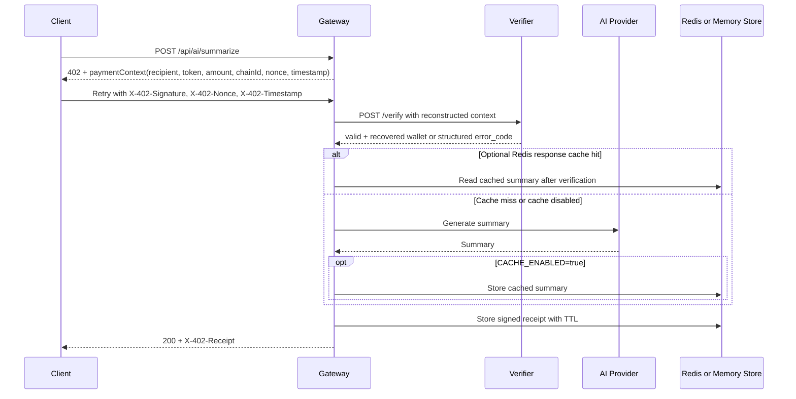

# Gateway Service

The gateway is the public API entry point for MicroAI Paygate. It is a Go/Gin service on port `3000` that owns HTTP routing, x402 payment challenges, verifier orchestration, AI provider calls, Redis-backed receipts/cache, rate limiting, CORS, gzip, request timeouts, and public API documentation.

## Responsibilities

- Return `402 Payment Required` with a complete payment context when summarize requests are unsigned.
- Require signed retries to include `X-402-Signature`, `X-402-Nonce`, and `X-402-Timestamp`.
- Reconstruct the payment context and call the Rust verifier at `POST /verify`.
- Map verifier business failures to sanitized public gateway errors.
- Call the configured AI provider only after payment verification succeeds.
- Sign a receipt over request/response hashes and store it with a TTL.
- Serve receipt lookup responses through `GET /api/receipts/:id`.
- Apply request timeouts, rate limits, CORS, gzip, and correlation IDs.

## Request Flow



## Public Routes

| Route | Purpose |
| --- | --- |
| `GET /healthz` | Liveness check for gateway process health. |
| `GET /readyz` | Dependency readiness check for verifier, active AI provider, Redis when required, and gateway self metrics. |
| `GET /openapi.yaml` | OpenAPI 3.1 contract for public gateway endpoints. |
| `GET /docs` | Swagger UI backed by `openapi.yaml`. |
| `POST /api/ai/summarize` | Payment-gated summarize endpoint. |
| `GET /api/receipts/:id` | Lookup a stored signed receipt until expiry. |

The verifier route `POST /verify` is not a gateway route. It belongs to the internal verifier service.

## Key Files

| File | Purpose |
| --- | --- |
| `main.go` | Server setup, routes, summarize handler, payment verification, receipt response path, health/readiness. |
| `config.go` | CORS origins, receipt store mode, timeout helpers. |
| `errors.go` | Sanitized public error mapping and correlation IDs. |
| `receipt.go` | Receipt model, hashing, signing, and validation. |
| `receipt_store.go` | In-memory receipt store and active store lifecycle. |
| `receipt_redis_store.go` | Redis receipt persistence. |
| `redis.go` | Redis client and response cache configuration. |
| `cache.go` | Optional response cache. Cache hits still require valid payment verification. |
| `ratelimit.go` | Token bucket implementation. |
| `middleware.go` | Request timeout and correlation ID middleware. |
| `internal/ai/` | OpenRouter and Ollama provider implementations. |
| `openapi.yaml` | Public gateway API contract. |

## Configuration

Required for normal OpenRouter gateway startup:

| Variable | Notes |
| --- | --- |
| `OPENROUTER_API_KEY` | Required when `AI_PROVIDER` is unset or `openrouter`. |
| `SERVER_WALLET_PRIVATE_KEY` | Required. Signs receipts. Use an unfunded development key locally. |
| `REDIS_URL` | Required when `RECEIPT_STORE=redis` or `CACHE_ENABLED=true`. |

Common optional variables:

| Variable | Default | Notes |
| --- | --- | --- |
| `PORT` | `3000` | Gateway listen port. |
| `AI_PROVIDER` | `openrouter` | Supported values: `openrouter`, `ollama`. |
| `OPENROUTER_MODEL` | `z-ai/glm-4.5-air:free` in code/docs unless overridden | OpenRouter model. |
| `OPENROUTER_URL` | `https://openrouter.ai/api/v1/chat/completions` provider default | Used by tests and custom OpenRouter-compatible endpoints. |
| `OLLAMA_URL` | `http://localhost:11434` | Used when `AI_PROVIDER=ollama`. |
| `OLLAMA_MODEL` | `llama2` provider default | Used when `AI_PROVIDER=ollama`. |
| `VERIFIER_URL` | **required** (no fallback) | Where the gateway calls `/verify`. Use `http://127.0.0.1:3002` for `bun run stack`, `http://verifier:3002` in Compose, the platform's HTTPS URL in production. The gateway refuses to start if unset. |
| `RECIPIENT_ADDRESS` | Development fallback address | Recipient embedded in payment contexts. |
| `PAYMENT_AMOUNT` | `0.001` | Amount string embedded in payment contexts. |
| `CHAIN_ID` | `84532` | Base Sepolia by default. Must match verifier `EXPECTED_CHAIN_ID`. |
| `ALLOWED_ORIGINS` | `http://localhost:3001` | Comma-separated origins only, no paths/query/fragments. |
| `TRUSTED_PROXIES` | unset | Comma-separated CIDRs/IPs trusted for `X-Forwarded-For`. Set before IP rate limiting behind proxies. |
| `RECEIPT_STORE` | `redis` | Use `memory` for tests/local experiments. |
| `RECEIPT_TTL` | `86400` | Receipt TTL in seconds. |
| `CACHE_ENABLED` | `false` | Optional response cache. |
| `CACHE_TTL_SECONDS` | `3600` | Response cache TTL. |
| `RATE_LIMIT_ENABLED` | disabled unless set to `true` or `1` | Enables token bucket middleware. |
| `REQUEST_TIMEOUT_SECONDS` | `60` | Global request timeout. |
| `AI_REQUEST_TIMEOUT_SECONDS` | `30` | AI route timeout. |
| `VERIFIER_TIMEOUT_SECONDS` | `2` | Verifier call timeout. |
| `HEALTH_CHECK_TIMEOUT_SECONDS` | `2` | Health/readiness helper timeout. |

## Local Development

From the repository root, the easiest path is:

```bash
bun install
(cd gateway && go mod download)
cp .env.example .env
bun run stack
```

To run only the gateway:

```bash
cd gateway
RECEIPT_STORE=memory CACHE_ENABLED=false go run .
```

The verifier must be reachable at `VERIFIER_URL` for signed requests. OpenRouter startup requires `OPENROUTER_API_KEY` unless `AI_PROVIDER=ollama`.

## Testing

```bash
cd gateway
gofmt -w .
go test -v ./...
go vet ./...
```

Run gateway tests after changing handlers, middleware, config parsing, receipt storage, cache, Redis, rate limits, OpenAPI, or provider behavior.

## API Errors

The gateway exposes sanitized public errors and logs internal details with a `correlation_id`. Public clients should rely on stable error codes such as:

- `invalid_signature`
- `invalid_timestamp`
- `chain_id_mismatch`
- `nonce_already_used`
- `verification_unavailable`
- `verifier_timeout`
- `upstream_unavailable`
- `upstream_timeout`
- `request_body_read_failed`
- `response_encoding_failed`
- `receipt_generation_failed`
- `receipt_store_failed`
- `receipt_encoding_failed`

Do not expose verifier internals, provider response bodies, private keys, Redis URLs, or raw secrets in public responses.
